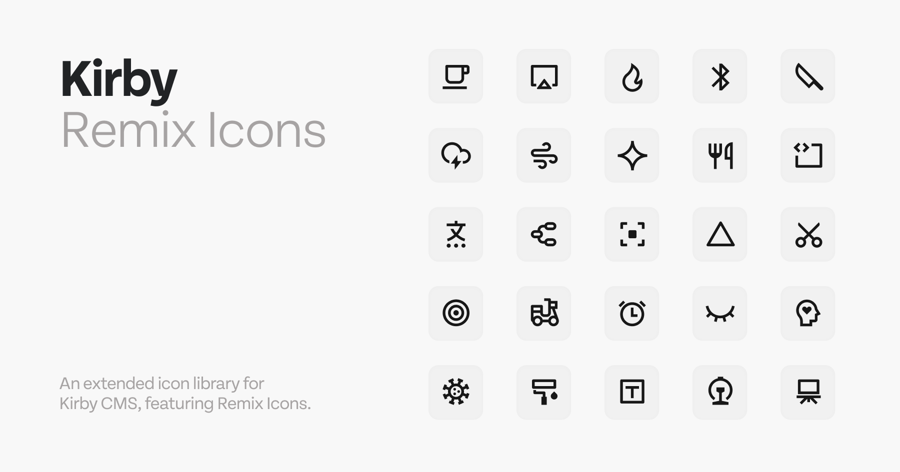

# Kirby Remix Icons



A Kirby CMS plugin for easy integration of [Remix Icons](https://remixicon.com/). This plugin provides SVG icons for use in blueprints and the panel.

> [!IMPORTANT]  
> By default, all icons of the Remix Icon set will be included, resulting in a rather large file to be loaded by the Panel. If you do not need the full set, consider [generating a smaller icon set](#generate-your-icon-set) for your specific use case with this plugin.

## Acknowledgments
Icons from [Remix Design](https://remixicon.com/). Support them at [BuyMeACoffee](https://buymeacoffee.com/remixdesign).

## Installation

### Via Composer
Run the following command in your Kirby CMS project:
```bash
composer require estd/kirby-remix-icons
```

### Manual Installation
1. Copy `kirby-remix-icons` to `/site/plugins/`.
2. Use icons in your blueprints by their names.

---

## Example Blueprint
```yaml
fields:
  fireLine:
    label: Fire Line Icon
    icon: fire-line
  fireFill:
    label: Fire Fill Icon
    icon: fire-fill
```

### Blueprint Examples
- **Fill Icon**: `arrow-down-box-fill`
- **Line Icon**: `arrow-down-line`

---

## Generate Your Icon Set
You can use the Python script to include your own custom SVGs.

### Steps:
1. Organize SVGs in the `icons/` directory (subfolders are optional).
2. Run the script:
   ```bash
   python3 generate_icons.py
   ```
3. Place the generated plugin in `/site/plugins/`.

### Example Icon Structure
```
icons/
    Arrows/
        arrow-down-box-fill.svg
        arrow-up-box-fill.svg
    Shapes/
        square-fill.svg
```

---

## License
This plugin uses [Remix Icons](https://remixicon.com/) under the Remix Design license:
- **Free for Personal and Commercial Use**: No attribution required but appreciated.
- **Prohibited Uses**:
  - Redistribution or sale of icons as is.
  - Use of icons in standalone applications, libraries, or design systems intended for distribution or sale.

For full terms, refer to [Remix Icon License](https://remixicon.com/license).
